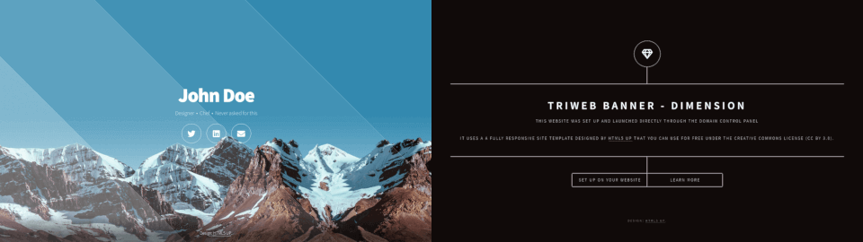

# Banner Themes

### [default](default/)

A minimalist theme perfect for simple web pages.

<a href="default/"></a>

### [html5up](html5up/)

Free templates from [html5up](https://html5up.net/) licensed under the [Creative Commons Attribution 3.0](https://html5up.net/license) license.

[](html5up/)


## Building your theme

You can build and use your own theme. The easiest way to do that is to copy the `manifest.json` file from one of the themes, 
update it with your theme's details, and publish it online along with your theme's HTML/CSS/JS files.
Once ready, you can use such a theme on your domain by replacing the value in the `app` TXT record with the URL of your customized manifest file, e.g.:

```
www.mydomain.example            CNAME   triweb.io.
_triweb.www.mydomain.example    TXT     "app https://.../manifest.json` 
```

[GitHub Gist](https://gist.github.com/) is an easy way to host your theme's files. 
Create a secret gist with your `manifest.json` and theme asset files.
Once ready, click on the RAW button next to your `mainfest.json` file to get a URL that you can use for the `app` record.
