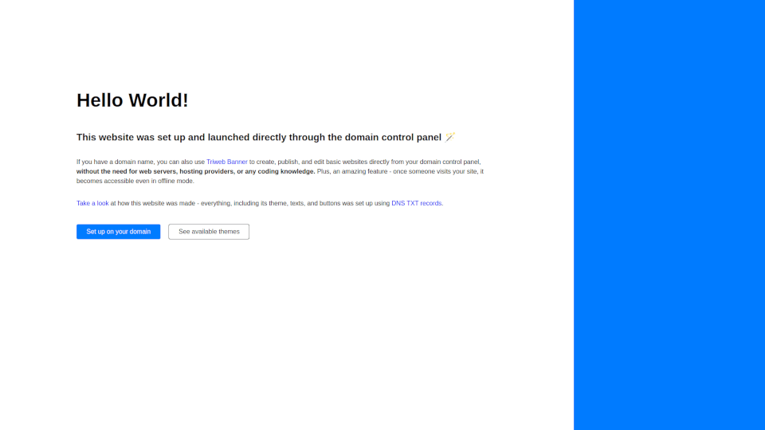

# Themes

## Available themes

### [default](default/)

A default theme for simple webpages

<a href="default/"></a>

### [html5up](html5up/)

A collection of free templates made by [html5up](https://html5up.net/) lincensed under the [Creative Commons Attribution 3.0](https://html5up.net/license) license.

[](html5up/)


## Building your own theme

You can build and use your own theme. The easiest way to do that is to copy the `manifest.json` file from one of the themes, 
update it with your theme's details, and publish it online along with the HTML/CSS/JS files of your theme.
Once ready, you can use such theme on your domain by replacing the value in the `app` TXT record with the URL of your customized manifest file, e.g.:

```
www.mydomain.example            CNAME   triweb.io.
_triweb.www.mydomain.example    TXT     "app https://.../manifest.json` 
```

You can use the [GitHub Gist](https://gist.github.com/) service to create a secret gist with a `manifest.json` file, and your theme asset files.
Once ready, you can click on the RAW button of your `mainfest.json` file in gist to get the URL that you can use for the `app` record.
