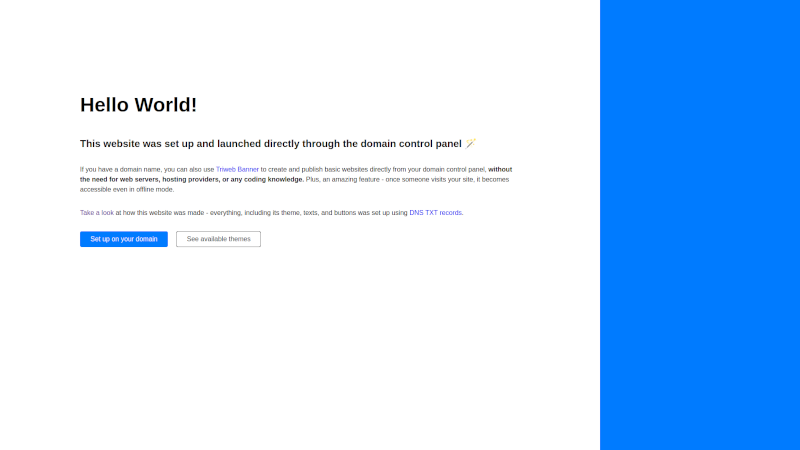

# Default Theme

**Theme identifier:** `default`

A minimalistic theme that can be used to build simple webpages.



## Live demo

You can access a preview of this theme on [banner.triweb.dev](https://banner.triweb.dev/).<br/>
[Click here](https://mxtoolbox.com/SuperTool.aspx?action=txt%3a_triweb.banner.triweb.dev&run=toolpage) to see the live TXT records that are used for this preview. 

## Example domain configuration

```
www.mydomain.example            CNAME   triweb.io.

_triweb.www.mydomain.example    TXT     "app banner"
_triweb.www.mydomain.example    TXT     "theme default"
_triweb.www.mydomain.example    TXT     "[h1] Hello world!"
```

## Available customization slots

The `default` theme has following customization slots:

### title

**Name:**       title<br/>
**Value:**      The title of the webpage - used as a content for the HTML title tag<br/>
**Options:**    - none -<br/>
**Example TXT record:** ```"[title] My webpage" ```

### h1

**Name:**       h1<br/>
**Value:**      A main heading that appears above the text<br/>
**Options:**    `color` (default black)<br/>
**Example TXT records:** 
```
"[h1] color=black"
"[h1] Hello World!"
```

### h2

**Name:**       h2<br/>
**Value:**      A sub-heading that appears above the text<br/>
**Options:**    `color` (default black)<br/>
**Example TXT record:** ```"[h2] Welcome to my website color=#f0f0f0"```

### p

**Name:**       p<br/>
**Value:**      One or more paragraphs of text formatted with markdown<br/>
**Options:**    - none -<br/>
**Example TXT records:** 
```
"[p][0] A first paragraph of text."
"[p][2] A second paragraph with **bold** text and a [link](/)."
```

### btn

**Name:**       btn<br/>
**Value:**      One or more action buttons that appear below the text<br/>
**Options:**    `href` (the target URL), `style` (one of: primary, secondary)<br/>
**Example TXT records:**
```
[btn][0] View my GitHub profile
[btn][0] href=https://github.com/ style=primary
[btn][1] Send me an email
[btn][1] href=mailto:me@mydomain.example
```

### sidebar

**Name:**       sidebar<br/>
**Value:**      The look and feel of the sidebar<br/>
**Options:**    `color` (background color), `img` (URL of the image)<br/>
**Example TXT records:**
```
[sidebar] color=red img=https://somedomain.example/image.png
```
