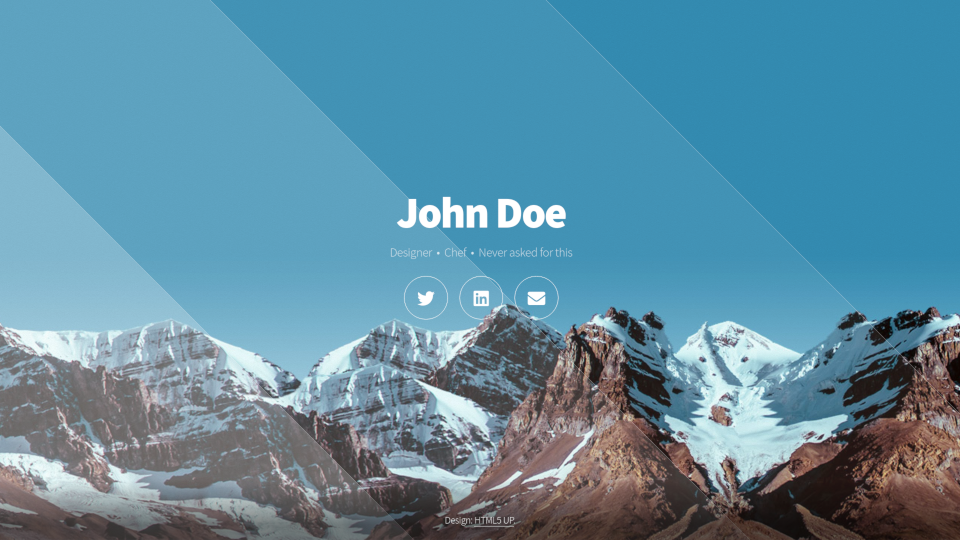

# banner/html5up/aerial

A port of the [Aerial website template](https://html5up.net/aerial) made by [html5up](https://html5up.net/) licensed under [CC BY 3.0](https://html5up.net/license).



## Live demo

You can access a preview of this theme on [aerial.banner.triweb.dev](https://aerial.banner.triweb.dev/).<br/>
[Click here](https://mxtoolbox.com/SuperTool.aspx?action=txt%3a_triweb.aerial.banner.triweb.dev&run=toolpage) to see the live TXT records that are used for the preview.

## Example domain configuration

```
www.mydomain.example            CNAME   triweb.io.

_triweb.www.mydomain.example    TXT     "app banner/themes/html5up/aerial"

_triweb.www.mydomain.example    TXT     "meta-title My Personal Website"
_triweb.www.mydomain.example    TXT     "meta-description A personal website of John Doe."

_triweb.www.mydomain.example    TXT     "[h1] John Doe"
_triweb.www.mydomain.example    TXT     "[p][0] Designer &nbsp;•&nbsp; Chef &nbsp;•&nbsp; Never asked for this"

_triweb.www.mydomain.example    TXT     "[links][0] https://twitter.com/your-twitter-username"
_triweb.www.mydomain.example    TXT     "[links][1] https://my.linkedin.com/company/your-company-name"
_triweb.www.mydomain.example    TXT     "[links][2] mailto:me@mydomain.com"

_triweb.www.mydomain.example    TXT     "[copyright] (c) Your Name."

```

## Available customization slots

This theme has following customization slots:

### h1

**Name:**       h1<br/>
**Value:**      A main heading<br/>
**Options:**    `color` (default white)<br/>
**Example TXT records:**
```
"[h1] Hello World!"
```

### p

**Name:**       p<br/>
**Value:**      One or more paragraphs of text formatted with markdown<br/>
**Options:**    - none -<br/>
**Example TXT records:**
```
"[p][0] A first paragraph of text."
"[p][2] A second paragraph with **bold** text and a [link](/)."
```

### links

**Name:**       links<br/>
**Value:**      One or more links with icons<br/>
**Options:**    `icon` (an icon from the fontawesome collection to use for the link) ; `brand` (set to `1` if icon is a brand name) ; `title` (a title for this link which appears on hover) ; `label` (a label for screen readers)<br/>
**Example TXT records:**
```
"[links][0] https://twitter.com/your-twitter-username"
"[links][1] https://my-website.example icon=globe title=Checkout my website"
"[links][1] https://skype.com/my-profile-url icon=skype brand=1 title=Find me on Skype"
```

### theme

**Name:**       theme<br/>
**Value:**      Theme configuration<br/>
**Options:**    `bg` - background color or image<br/>
**Example TXT records:**
```
"[theme] bg=https://somedomain.example/image.png"
```

```
"[theme] bg=black"
```

### css

**Name:**       css<br/>
**Value:**      Optional additional CSS to use<br/>
**Options:**    - none -<br/>
**Example TXT records:**

```
[css] p { color:gold !important; }
```

### copyright

**Name:**       copyright<br/>
**Value:**      A copyright text that appears in footer<br/>
**Options:**    - none -<br/>
**Example TXT records:**
```
[copyright] (c) Your Name.
```

