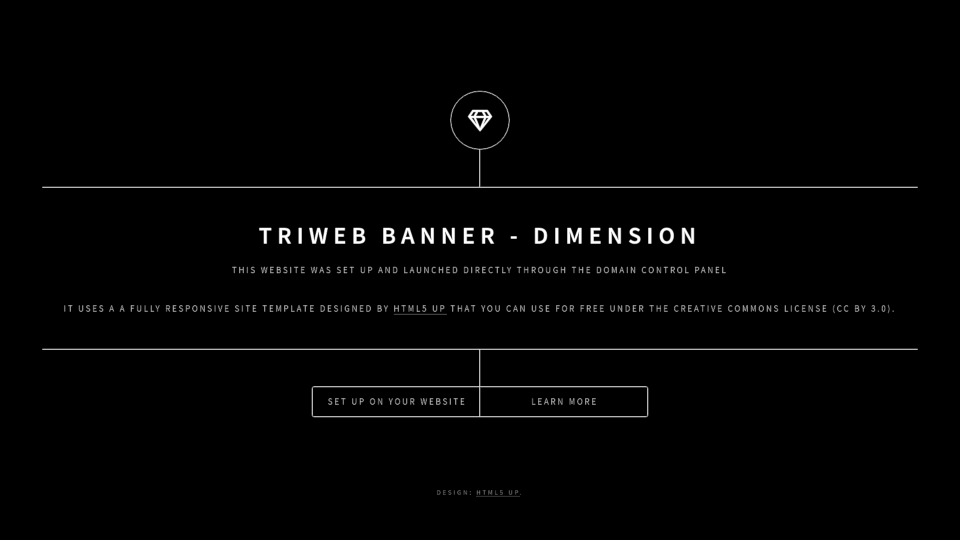

# banner/html5up/dimension

A port of the [Dimension website template](https://html5up.net/dimension) made by [html5up](https://html5up.net/) and licensed under [CC BY 3.0](https://html5up.net/license).



## Live demo

Experience this theme live at [dimension.banner.triweb.dev](https://dimension.banner.triweb.dev/).<br/>
To view the TXT records powering this demo, click [here](https://mxtoolbox.com/SuperTool.aspx?action=txt%3a_triweb.dimension.banner.triweb.dev&run=toolpage).

## Example domain configuration

```
www.mydomain.example            CNAME   triweb.io.

_triweb.www.mydomain.example    TXT     "app banner/themes/html5up/dimension"

_triweb.www.mydomain.example    TXT     "meta-title Triweb Banner - html5up dimension theme"
_triweb.www.mydomain.example    TXT     "meta-description Publish simple websites directly from your domain control panel in minutes!"

_triweb.www.mydomain.example    TXT     "[theme] icon=gem bg=black"

_triweb.www.mydomain.example    TXT     "[h1] TRIWEB BANNER - DIMENSION"

_triweb.www.mydomain.example    TXT     "[p][0] This website was set up and launched directly through the domain control panel"
_triweb.www.mydomain.example    TXT     "[p][1] It uses a a fully responsive site template designed by [html5 up](https://html5up.net) that you can use for free under the creative commons license (CC BY 3.0)."

_triweb.www.mydomain.example    TXT     "[0][0] title=Learn more ref=learn"
_triweb.www.mydomain.example    TXT     "[0][1] [Triweb Banner](https://triweb.com/apps/banner) allows you to create, publish, and edit basic websites directly from your domain control panel, **without the need for web servers, hosting providers, or any coding knowledge.**"

_triweb.www.mydomain.example    TXT     "[1][0] title=Set up on your website ref=use"
_triweb.www.mydomain.example    TXT     "[1][1] To set up this theme on your website, please visit [this page](https://github.com/triweb/triweb-apps-banner/master/themes/html5up/dimension)."

```

## Available customization slots

This theme has following customization slots:

### theme

**Name:**       theme<br/>
**Value:**      Theme configuration<br/>
**Options:**    `icon` - An icon from the fontawesome collection to use at the homepage ; `bg` - background color or image<br/>
**Example TXT records:**
```
"[theme] icon=gem bg=https://somedomain.example/image.png"
```


### h1

**Name:**       h1<br/>
**Value:**      A main heading that appears above the text<br/>
**Options:**    `color` (default black)<br/>
**Example TXT records:**
```
"[h1] color=black"
"[h1] Hello World!"
```

### p

**Name:**       p<br/>
**Value:**      One or more paragraphs of text formatted with markdown<br/>
**Options:**    - none -<br/>
**Example TXT records:**
```
"[p][0] A first paragraph of text."
"[p][2] A second paragraph with **bold** text and a [link](/)."
```

### css

**Name:**       css<br/>
**Value:**      Optional additional CSS to use<br/>
**Options:**    - none -<br/>
**Example TXT records:**

```
[css] p { color:gold !important; }
```

### copyright

**Name:**       copyright<br/>
**Value:**      A copyright text that appears in footer<br/>
**Options:**    - none -<br/>
**Example TXT records:**
```
[copyright] (c) Some Company Inc.
```

## Dynamic slots

Dynamic slots are number-based slots that let you create multiple independent sections of the webpage. 
In the Dimension template you can use them to specify the navigation links, with the image and text for the popup that appears after the user clicks on the link.

**Example TXT records:**

```
[0][0] title=Read more ref=readmore img=https://somedomain.example/image.png
[0][1] This text will be visible in the popup once user clicks on the Read more link.
[0][2] You can use **markdown** in the text.
[0][3]
[0][4] Separate paragraphs with an empty line or \n\n. 

[1][0] title=Contact me
[1][1] This text will be visible in a popup once user clicks on the Contact me link.   
```
